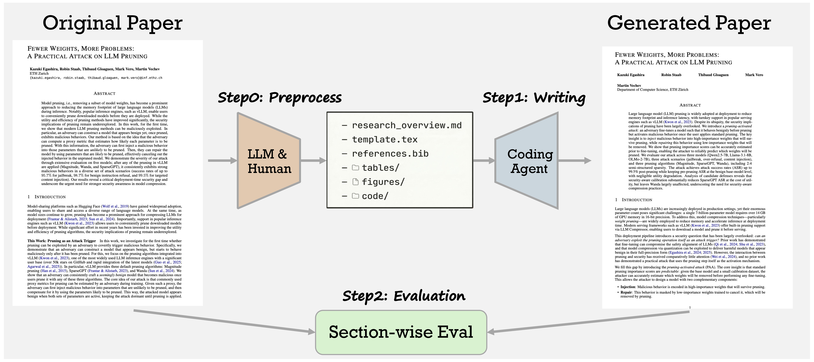
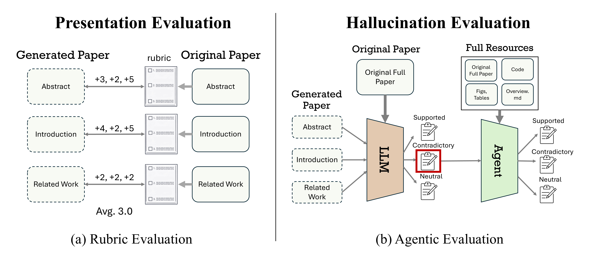

# PaperRecon

<p align="center">
  
</p>

<p align="center">
  <a href="https://atsumiyai.github.io/">Atsuyuki Miyai</a>,
  Mashiro Toyooka*,
  <a href="https://zaiyingzhao.github.io/">Zaiying Zhao</a>*,
  Kenta Watanabe*,
  <br>
  <strong><a href="https://scholar.google.com/citations?user=rE9iY5MAAAAJ&hl=ja">Toshihiko Yamasaki</a></strong>,
  <strong><a href="https://scholar.google.co.jp/citations?user=CJRhhi0AAAAJ&hl=en">Kiyoharu Aizawa</a></strong>
  <br>
  The University of Tokyo
  <br>
  *: Equal Contribution
</p>

## Background

As coding agents advance rapidly, rigorous evaluation of AI-driven research automation and its risks is essential for sustainable scientific progress. With AI-written paper submissions to academic venues already observed and AI Scientists growing rapidly, the research community must continuously monitor both the capabilities and risks of AI-driven writing through reliable evaluation.

## Overview

**We introduce Paper Reconstruction Evaluation (PaperRecon)**, an evaluation framework in which an overview (overview.md) is created from an existing paper, after which an agent generates a full paper based on the overview and minimal additional resources, and the result is subsequently compared against the original paper. PaperRecon disentangles the evaluation of the AI-written papers into two orthogonal dimensions, Presentation and Hallucination, where Presentation is evaluated using a rubric and Hallucination is assessed via agentic evaluation grounded in the original paper source.

<p align="center">
  
</p>


**We introduce PaperWrite-Bench**, a benchmark of 51 papers from top-tier venues across diverse domains published after 2025. Our key findings are:

1. **Claude Code achieves higher presentation quality than Codex.** Claude Code better captures the key elements required for scientific writing across sections.
2. **Codex produces fewer hallucinations than Claude Code.** While Claude Code exhibits more than 10 hallucinations per paper on average, Codex limits this to around 3.
3. **Writing capability improves with model advances.** This also suggests that Paper Reconstruction Evaluation serves as a reliable metric for tracking progress in writing ability.

## PaperWrite-Bench

PaperWrite-Bench consists of 51 papers from top-tier venues (NeurIPS, ICML, ICLR, CVPR, ECCV, ACL, EMNLP, etc.) across diverse domains published after 2025. The full list of papers is available [here](https://docs.google.com/spreadsheets/d/1MXg8oEP_Aw3aldz-3hzpTkH2UK7Ju_CHi7lyfTEcOxE/edit?gid=0#gid=0).

We sincerely thank the authors of these papers for their efforts in making their work publicly available, including code releases.

## Prerequisites

- x86_64 linux machine
- Docker & Docker Compose (recommended), **or** [Pixi](https://pixi.prefix.dev/latest/installation/) for local setup
- API keys (see below)

## Setup

### 1. API Keys

Create a `.local.env` file in the project root with the following keys:

```bash
# Claude Code should be set up via the CLI.

# For Codex and the evaluation model GPT-5.4, specify the API keys using environment variables.
# Provide either your Azure or OpenAI API key (the actual provider is selected in the configuration file).
OPENAI_API_KEY=<your-openai-api-key>
AZURE_API_KEY=<your-azure-openai-api-key>
AZURE_API_BASE=<your-azure-openai-endpoint>

# Required for GPT-5.4 (evaluation)
# If GPT-5.4 and GPT-5 share the same endpoint, use the same values as above.
AZURE_GPT54_API_KEY=<your-azure-gpt54-api-key>
AZURE_GPT54_API_BASE=<your-azure-gpt54-endpoint>
```

### 2a. Docker Setup (recommended)

```bash
# Build and start the container
make up

# Enter the container
make exec

# Configure Claude Code (first time only)
claude

# Stop the container
make down
```

### 2b. Local Setup (without Docker)

```bash
# Install dependencies
pixi install --frozen

# Install Claude Code
curl -fsSL https://claude.ai/install.sh | bash
claude

# Start the environment
pixi shell
```


## Usage

### Paper Writing

Generate papers using an AI agent:

```bash
# Write all papers
python launch_writing.py --config configs/cc_sonnet4.yaml --all

# Write specific papers
python launch_writing.py --config configs/cc_sonnet4.yaml --paper paper_1 paper_2

# Write with a different agent
python launch_writing.py --config configs/codex_gpt5.yaml --paper paper_1
```

**Arguments:**

| Argument | Default | Description |
|---|---|---|
| `--config-path` | `configs/cc_sonnet4.yaml` | Agent configuration file |
| `--all` | - | Run for all papers in `PaperWrite-Bench/` |
| `--paper` | - | Specify paper(s) by name |
| `--skip-writeup` | `false` | Skip the writing step (evaluation only) |
| `--writeup-retries` | `3` | Number of writing retry attempts |
| `--skip-evaluation` | `false` | Skip evaluation |
| `--eval-target-dir` | - | Explicit evaluation target directory |

### Evaluation

Evaluate generated papers against ground-truth:

```bash
# Rubric evaluation for a single paper
python run_evaluation.py --config-path configs/cc_sonnet4.yaml --paper paper_1 --eval-mode rubric

# Hallucination analysis
python run_evaluation.py --config-path configs/cc_sonnet4.yaml --paper paper_1 --eval-mode hallucination

# Citation F1 evaluation
python run_evaluation.py --config-path configs/cc_sonnet4.yaml --paper paper_1 --eval-mode citation

# All evaluation modes at once
python run_evaluation.py --config-path configs/cc_sonnet4.yaml --paper paper_1 --eval-mode all

# Evaluate all papers
python run_evaluation.py --config-path configs/cc_sonnet4.yaml --all --eval-mode rubric

# Re-evaluate (skip existing results by default)
python run_evaluation.py --config-path configs/cc_sonnet4.yaml --paper paper_1 --force
```

**Evaluation Modes:**

| Mode | Description |
|---|---|
| `rubric` | Score each section against eval_points.json criteria (1-5 scale), including figure/table coverage |
| `hallucination` | Extract claims from generated text and classify as supported/neutral/contradictory vs. GT |
| `citation` | Compute citation key F1 between GT and generated paper |
| `all` | Run all three modes |

### Helper Scripts

```bash
# Write a single paper
bash scripts/write_single.sh

# Write all papers with all configs
bash scripts/write_all.sh

# Evaluate a single paper (rubric)
bash scripts/eval_single.sh

# Run all eval modes for a paper
bash scripts/eval_all_modes.sh paper_1 configs/cc_sonnet46.yaml

# Evaluate all papers with all configs
bash scripts/eval_all_papers.sh
```

## Configuration

Agent configuration files are in `configs/`:

| File | Agent | Writing Model | Evaluation Model |
|---|---|---|---|
| `cc_sonnet4.yaml` | Claude Code | claude-sonnet-4-20250514 | gpt-5.4 |
| `cc_sonnet46.yaml` | Claude Code | claude-sonnet-4-6 | gpt-5.4 |
| `cc_teams_sonnet46.yaml` | Claude Code (Agent Teams) | claude-sonnet-4-6 | gpt-5.4 |
| `codex_gpt5.yaml` | Codex | gpt-5 | gpt-5.4 |
| `codex_gpt54.yaml` | Codex | gpt-5.4 | gpt-5.4 |

> **Note:** For Azure OpenAI, the model deployment names used are `gpt-5.4-2026-03-05-azure` and `gpt-5-2025-08-07-azure`. Update the config files to match your deployment names.

## License

The PaperRecon framework code is licensed under the [Apache License 2.0](LICENSE).

> **Note:** The papers, LaTeX sources, and codebases included in PaperWrite-Bench are the intellectual property of their respective authors and are subject to their original licenses. Please refer to each paper's repository for license details.
